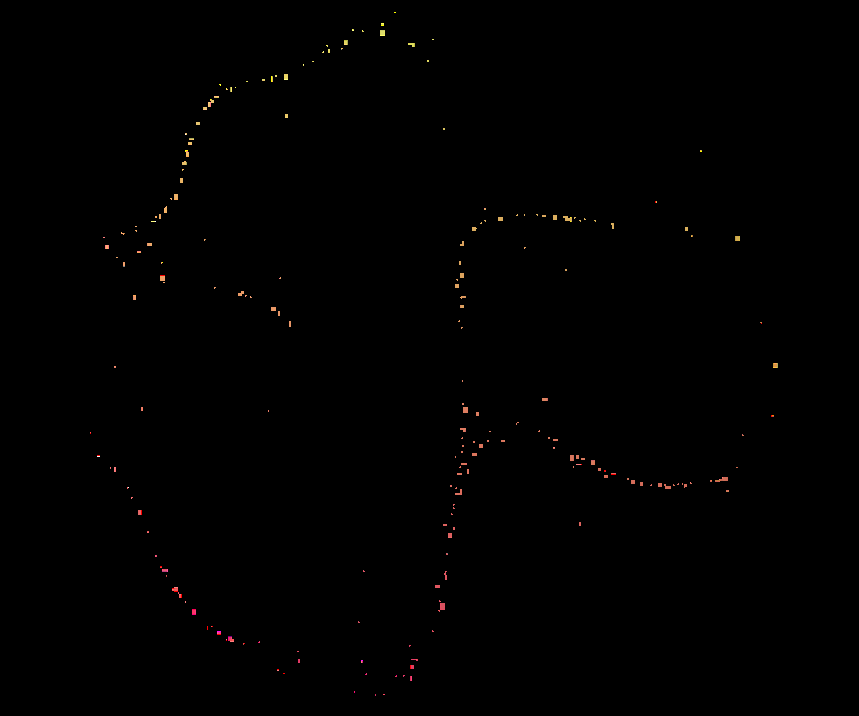

# genuary2022
here are my sketches for genuary 2022
### Jan 1 - Perfect Loop

### Jan 2 - Made in 10 minutes

### Jan 3 - Glitch Art
![This is an image]
### Jan 4 - Intersections
![This is an image]
### Jan 5 - Debug view
![This is an image]
### Jan 6 - Steal Like An Artist
![This is an image]
### Jan 7 - Sample a color palette from your favorite movie/album cover
![This is an image]
### Jan 8 - SDF
![This is an image]
### Jan 9 - Plants
![This is an image]
### Jan 10 - Generative music
![This is an image]
### Jan 11 - Suprematism
![This is an image]
### Jan 12 - Tessellation
![This is an image]
### Jan 13 - Something you've always wanted to learn
![This is an image]
### Jan 14 - Aesemic
![This is an image]
### Jan 15 - Sine waves
![This is an image]
### Jan 16 - Reflection of reflection
![This is an image]
### Jan 17 - A grid inside a grid inside a grid
![This is an image]
### Jan 18 - Definitely not a grid
![This is an image]
### Jan 19 - Black and white
![This is an image]
### Jan 20 - Art Deco
![This is an image]
### Jan 21 - Persian Rug
![This is an image]
### Jan 22 - Shadows
![This is an image]
### Jan 23 - More Moire
![This is an image]
### Jan 24 - Textile
![This is an image]
### Jan 25 - Yayoi Kusama
![This is an image]
### Jan 26 - My kid could have made that
![This is an image]
### Jan 27 - In the style of Hilma Af Klint
![This is an image]
### Jan 28 - Generative poetry
![This is an image]
### Jan 29 - Maximalism
![This is an image]
### Jan 30 - Minimalism
![This is an image]
### Jan 31 - Deliberately break one of your previous images, take one of your previous works and ruin it. Alternatively, remix one of your previous works.

